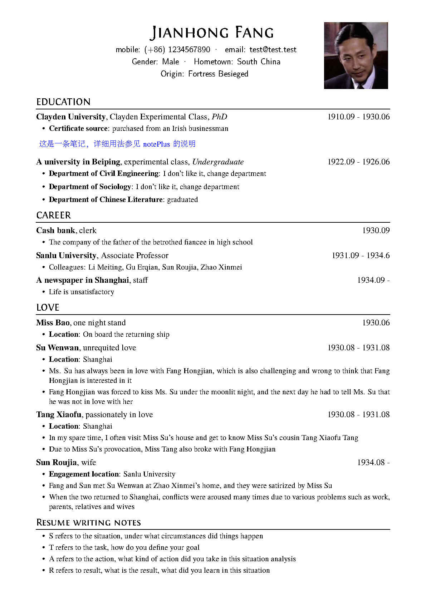

# resume in English & Chinese 中英双语简历模板

## advantages 优势

- support photo 支持图片
- prepare a bilingual document with single content source but with Chinese/English language form 一行中文所写的内容，紧接着写对应的英语翻译，最后选择输出简历的语言格式
- take notes while writing your main document, you can determine whether notes are printed or not 选择输出不含笔记的一页式投递版简历或者包含笔记的完整版简历

## usage 使用方法

- method 1: download this repo as zip and upload to overleaf 下载为本仓库为ZIP文件，上传到overleaf
- method 2: use overleaf template directly 直接使用overleaf模板

